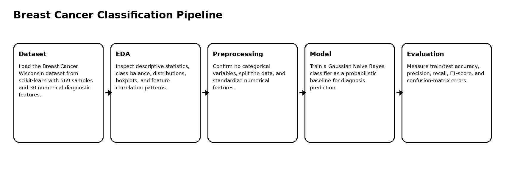
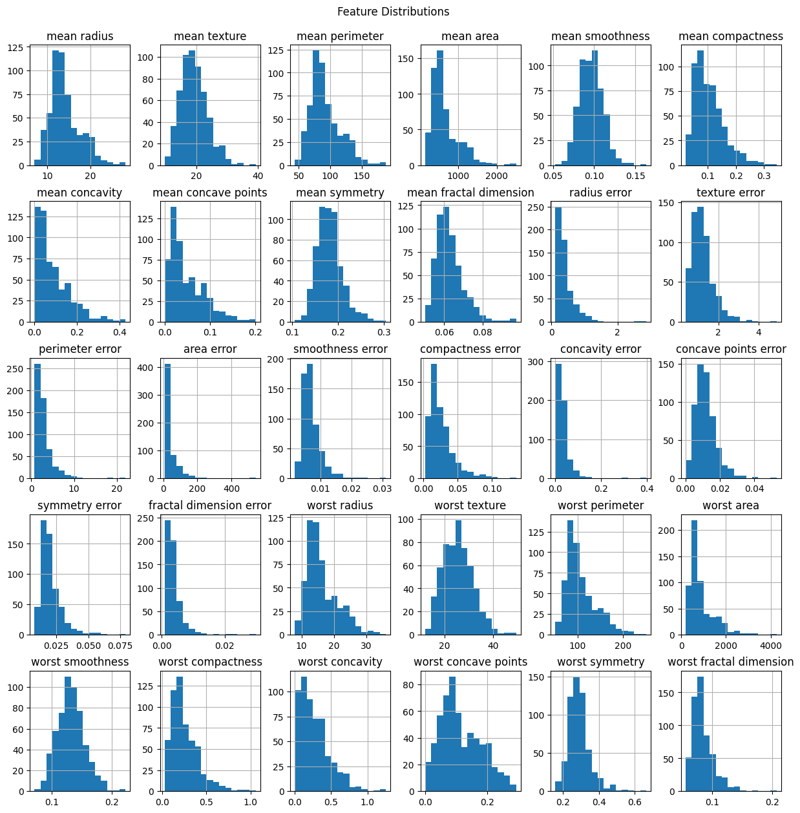
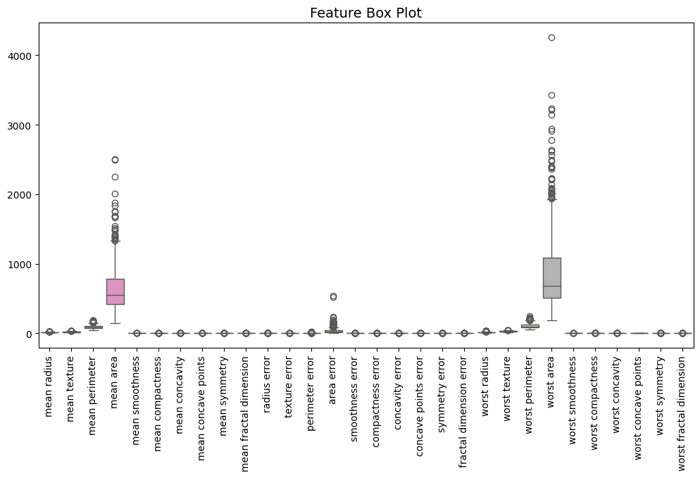
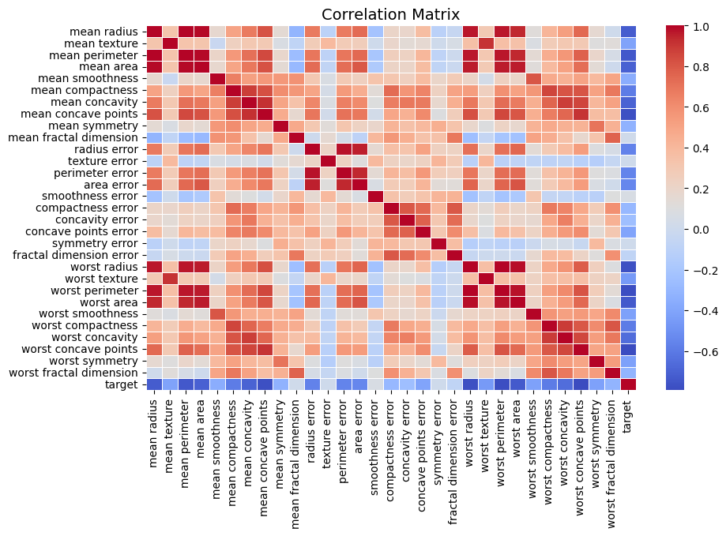
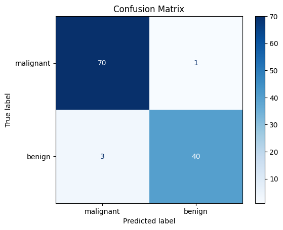

# Breast Cancer Classification with Gaussian Naive Bayes

Machine learning workflow for breast cancer diagnosis classification using the Breast Cancer Wisconsin dataset, exploratory data analysis, feature scaling, Gaussian Naive Bayes, and classification metrics.

## Overview

This project builds supervised learning pipeline for classifying breast cancer diagnosis labels using numerical diagnostic features from the Breast Cancer Wisconsin dataset.

The workflow includes exploratory data analysis, feature distribution review, correlation analysis, feature scaling, model training, and classification evaluation.

## Dataset

| Item | Value |
|---|---:|
| Dataset | Breast Cancer Wisconsin |
| Source | scikit-learn built-in dataset |
| Samples | 569 |
| Features | 30 numerical diagnostic features |
| Target classes | benign / malignant |
| Benign samples | 357 |
| Malignant samples | 212 |

## Pipeline



## Exploratory Data Analysis

| Correlation heatmap | Feature boxplots |
|---|---|
|  |  |



## Model

The project uses **Gaussian Naive Bayes**, a probabilistic classifier that assumes features follow class-conditional Gaussian distributions. It is a useful baseline for numerical classification problems because it is lightweight, interpretable, and fast to train.

## Results

| Metric | Value |
|---|---:|
| Train accuracy | 0.94 |
| Test accuracy | 0.96 |
| Benign precision | 0.98 |
| Benign recall | 0.93 |
| Benign F1-score | 0.95 |
| Malignant precision | 0.96 |
| Malignant recall | 0.99 |
| Malignant F1-score | 0.97 |



## Key Findings

1. The dataset contains only numerical variables, so categorical encoding was not required.
2. Gaussian Naive Bayes achieved strong generalization with 96% test accuracy.
3. The model performed especially well on the malignant class, reaching 0.99 recall.
4. Train and test accuracy were close, suggesting no severe overfitting.
5. Correlation and distribution plots show meaningful separation patterns among several diagnostic features.

## Repository Structure

```text
.
├── breast_cancer_naive_bayes_classification.ipynb
├── src/
│   └── train.py
├── docs/
│   └── figures/
├── results/
│   └── model_metrics.csv
├── requirements.txt
├── .gitignore
└── README.md
```

## Run Locally

Create a clean Python environment and install the dependencies.

### Windows PowerShell

```powershell
py -3.10 -m venv .venv
.\.venv\Scripts\Activate.ps1
python -m pip install --upgrade pip
pip install -r requirements.txt
```

### Linux / macOS

```bash
python3 -m venv .venv
source .venv/bin/activate
python -m pip install --upgrade pip
pip install -r requirements.txt
```


## Open the Notebook

```bash
jupyter notebook breast_cancer_naive_bayes_classification.ipynb
```

## Optional Script Usage

```bash
python src/train.py
```

## Notes

This project is for educational and research purposes only. It is not a medical diagnostic device or a substitute for clinical judgment.
